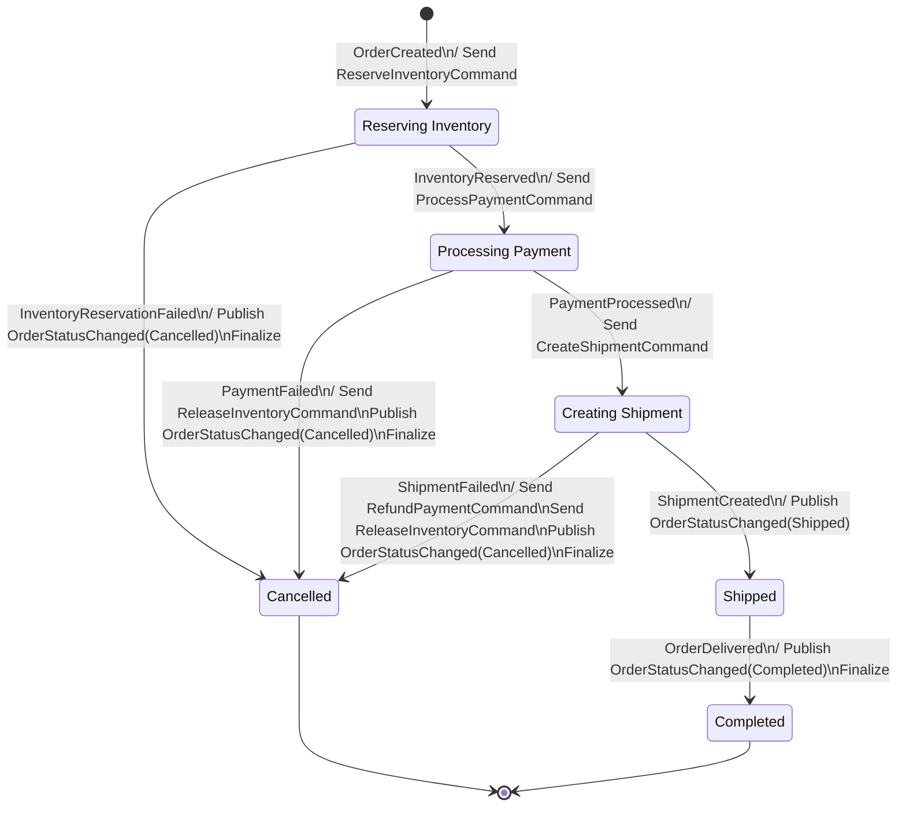

## ✅ What Works Correctly
1. Saga Definition: The OrderCreateSaga correctly defines all the states and transitions.
2. Domain Events: Order creation properly raises domain events that trigger the saga.
3. Configuration: The saga is properly configured in the DI container.
4. Order Tracking UI: Shows the correct workflow steps.

## Saga Flow Diagram 

## 🔧 Required Fixes to Make Frontend Follow Saga Logic
The changes I made to the Frontend are just the first step. To fully implement the saga pattern, you need:

1. Create Inventory Service that handles:

- ReserveInventoryCommand → publishes InventoryReservedIntegrationEvent or InventoryReservationFailedIntegrationEvent
- ReleaseInventoryCommand → publishes InventoryReleasedIntegrationEvent

2. Create Shipping Service that handles:

- CreateShipmentCommand → publishes ShipmentCreatedIntegrationEvent or ShipmentFailedIntegrationEvent
- Delivery tracking → publishes OrderDeliveredIntegrationEvent

3. Update Payment Service to handle:

- ProcessPaymentCommand → publishes PaymentProcessedIntegrationEvent or PaymentFailedIntegrationEvent
- RefundPaymentCommand → publishes PaymentRefundedIntegrationEvent or PaymentRefundFailedIntegrationEvent
The Frontend changes I made ensure it only creates orders and lets the saga handle the rest.